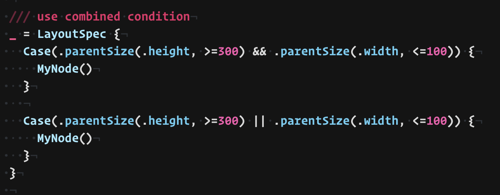

# Hello

hoge



[gif](1.gif)


filedownload => [here](LayoutCondition.swift)

```swift
func foo() {

}
```

<Picker text={"hoge"} />

<video autoplay loop src="./sample-movie.mp4" />

<Video src={"./sample-movie.mp4"} />

<Video>
  <source src={"./sample-movie.mp4"} type="video/mp4" />
</Video>
